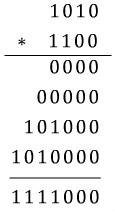

# 문제 4.5 곱셈과 덧셈 없이 x * y 계산하기
### Q. 다음 연산자만을 사용해 음이 아닌 정수 두 개의 곱셈을 수행하는 프로그램을 작성하라.
* 대입 연산자
* 비트 연산자
* 동등성 확인과 불 조합 연산

### A. 2진수의 곱셈 활용
* 이진수 곱셈
  * ex) 10 (=1010) x 12(=1100) = 120(=111000)  
    
* 각 덧셈은 비트별로 수행
  * 두 비트 모두 1인 경우 올림 수 고려

